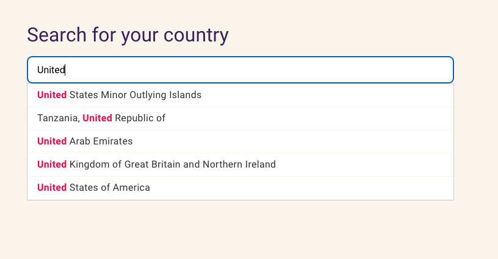
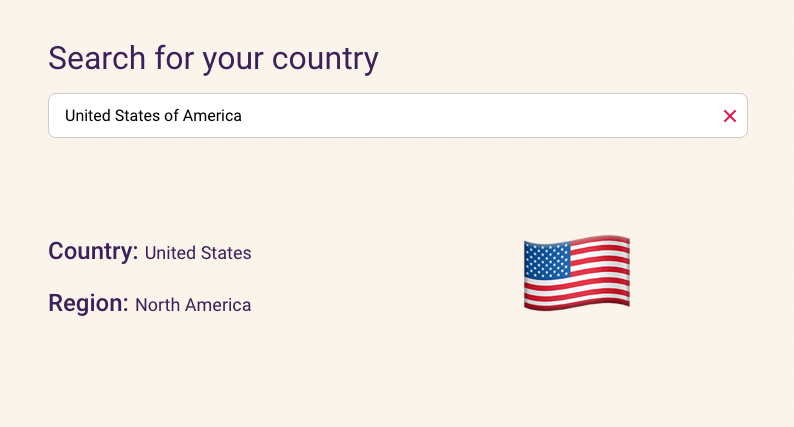

<h1 align="center">Auto-complete</h1>

### 📝 About the project
This is an auto-complete project made with ReactJS and Typescript, you can search for any country and select one of the list to see more details.
  

  

  

 

### 🏁 Starting the project
Clone: `git clone https://github.com/leopacciulli/auto-complete.git`
  

### 🖥 Running the project

After clone, install dependencies
 
`yarn install`

 

After install dependencies, run the command to be available in http://127.0.0.1:5174/
 
`yarn dev`

 

---

<h3 align="center">Made by Leonardo Pacciulli</h3>